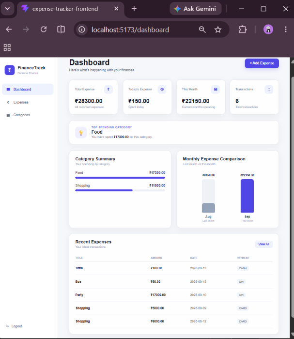
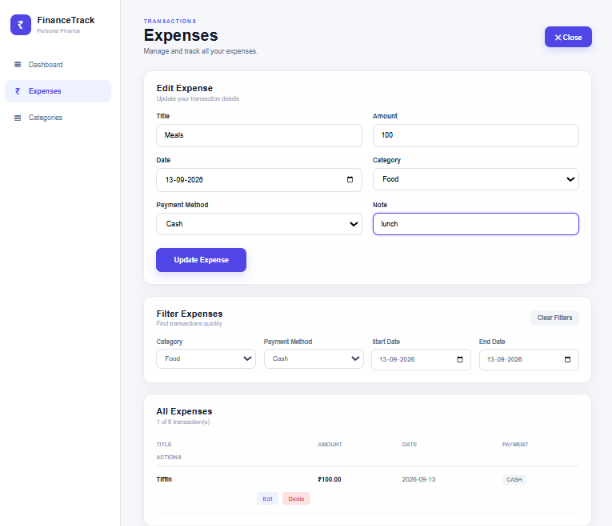
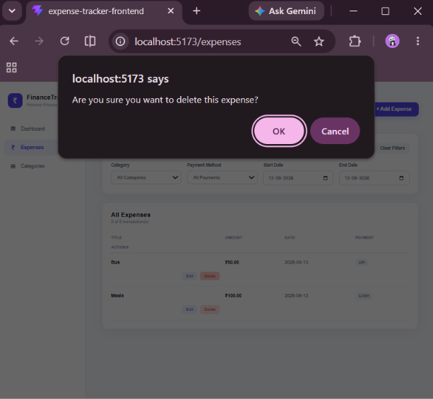
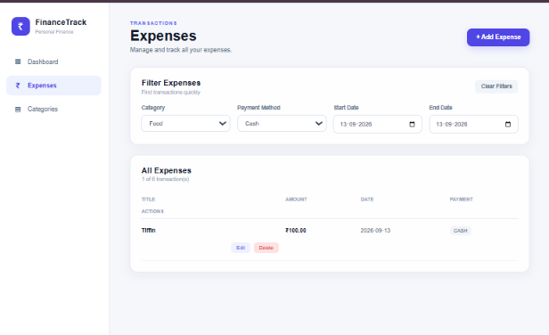
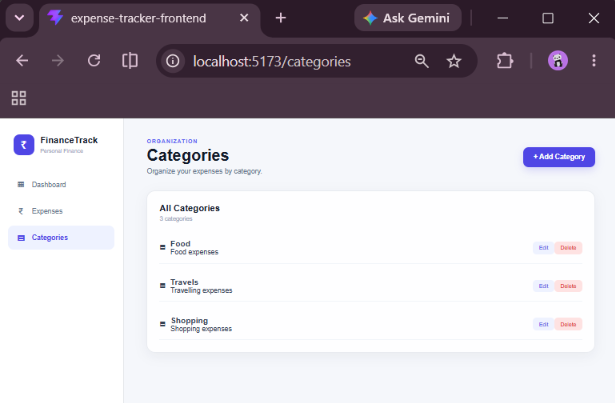

# 💰 Personal Finance & Expense Tracker

A secure full-stack web application for managing personal expenses, organizing spending by categories, and analyzing financial activity through an interactive dashboard.

The application combines a **React frontend** with a **Spring Boot REST API backend**, **Spring Security and JWT authentication**, **JPA/Hibernate**, and **MySQL**.

---

## 📸 Application Screenshots

### 📝 User Registration


### 📊 Dashboard

The dashboard provides an overview of total expenses, today's spending, current-month spending, transaction count, category-wise spending, monthly spending, top spending category, and recent transactions.




### ✏️ Edit Expense

Users can update existing expense information through the expense management interface.



### ✏️ Delete Expense

Users can delete existing expense information through the expense management interface.



### 🔎 Expense Filtering

Expenses can be filtered using category, payment method, and date range.



### 📂 Category Management

Users can manage expense categories through the application.



---

# 🚀 Features

## 🔐 Authentication & Security

- User Registration
- User Login
- JWT Token Generation
- JWT-based Authentication
- Protected REST APIs
- Password Encryption using BCrypt
- Spring Security Integration
- User-specific expense data isolation

## 👤 User Management

- Create User
- View User
- Update User
- Delete User
- Secure authenticated access

## 📂 Category Management

- Add Category
- View All Categories
- View Category by ID
- Update Category
- Delete Category

## 💵 Expense Management

- Add Expense
- View All Expenses
- View Expense by ID
- Update Expense
- Delete Expense

## 🔎 Expense Filtering

Authenticated users can filter their own expenses by:

- Category
- Date Range
- Payment Method

## 📊 Dashboard Analytics

The application provides:

- Total Expense
- Today's Expense
- This Month's Expense
- Expense Count
- Category-wise Expense Summary
- Monthly Expense Summary
- Top Spending Category
- Recent Expenses
- Monthly spending comparison

---

# 🏗️ System Architecture

```text
                    React Frontend
                         │
                         │ Axios / HTTP
                         ▼
                 Spring Boot REST API
                         │
                         ▼
                Spring Security + JWT
                         │
                         ▼
                   Service Layer
                         │
                         ▼
                 Repository Layer
                         │
                         ▼
                 JPA / Hibernate
                         │
                         ▼
                      MySQL