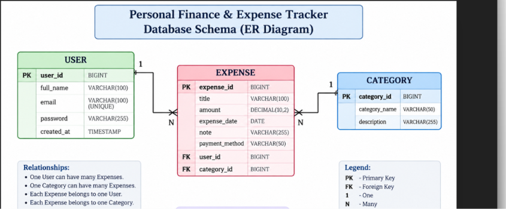
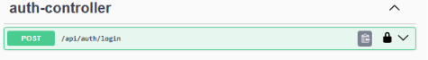
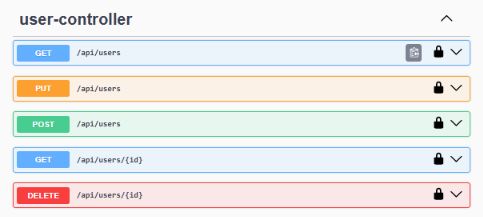
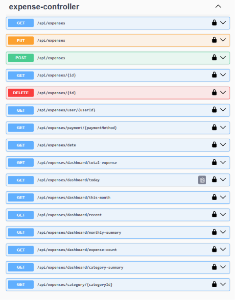
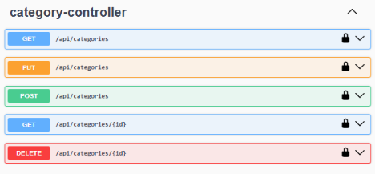

# 💰 Personal Finance & Expense Tracker

A secure RESTful Personal Finance & Expense Tracker backend built using **Java, Spring Boot, Spring Security, JWT Authentication, Spring Data JPA, Hibernate, and MySQL**.

The application allows users to authenticate securely, manage users and expense categories, record expenses, filter expenses, and view dashboard analytics through REST APIs.

---

# 🚀 Features

## 🔐 Authentication & Security

- User Registration
- User Login
- JWT Token Generation
- JWT-based Authentication
- Protected REST APIs
- Password Encryption using BCrypt
- Spring Security Integration

## 👤 User Management

- Create User
- View All Users
- View User by ID
- Update User
- Delete User

## 📂 Category Management

- Add Category
- View All Categories
- View Category by ID
- Update Category
- Delete Category

## 💵 Expense Management

- Add Expense
- View All Expenses
- View Expense by ID
- Update Expense
- Delete Expense

## 🔎 Expense Filtering

- Filter expenses by User
- Filter expenses by Category
- Filter expenses by Date Range
- Filter expenses by Payment Method

## 📊 Dashboard Analytics

- Total Expense
- Category-wise Expense Summary
- Monthly Expense Summary
- Today's Expense
- This Month's Expense
- Recent Expenses
- Expense Count

## 🛡️ Validation & Exception Handling

- Bean Validation
- Input Validation
- Global Exception Handling
- Custom `ResourceNotFoundException`
- Validation Error Handling
- Authentication Error Handling
- HTTP 400, 401, 403, 404 and 500 responses

## 📖 API Documentation

- Swagger UI
- OpenAPI Documentation
- JWT Bearer Authentication support in Swagger

## 🧪 Unit Testing

- JUnit 5
- Mockito
- Service Layer Unit Testing
- Success Case Testing
- Exception / Edge Case Testing
- Repository Interaction Verification

---

# 🛠️ Tech Stack

## Backend

- Java 21
- Spring Boot 3.5.4
- Spring Web
- Spring Security
- JWT
- Spring Data JPA
- Hibernate
- Bean Validation

## Database

- MySQL

## API Documentation

- Swagger / OpenAPI

## Testing

- JUnit 5
- Mockito

## Build Tool

- Maven

---

# 📁 Project Structure

```text
expense-tracker
│
├── src
│   ├── main
│   │   ├── java
│   │   │   └── com.personalfinance.expense_tracker
│   │   │       ├── config
│   │   │       ├── controller
│   │   │       ├── dto
│   │   │       ├── entity
│   │   │       ├── exception
│   │   │       ├── mapper
│   │   │       ├── repository
│   │   │       ├── security
│   │   │       ├── service
│   │   │       └── service.impl
│   │   │
│   │   └── resources
│   │       └── application.properties
│   │
│   └── test
│       └── java
│           └── com.personalfinance.expense_tracker
│               └── service
│                   ├── ExpenseServiceImplTest
│                   ├── UserServiceImplTest
│                   └── CategoryServiceImplTest
│
├── screenshots
│   ├── swagger-auth.png
│   ├── swagger-user.png
│   ├── swagger-categories.png
│   ├── swagger-expenses.png
│   └── database-er-diagram.png
│
├── pom.xml
└── README.md
```

---

# 🗄️ Database Schema

The application uses **MySQL** for persistent data storage.

The database contains three main entities:

- `user`
- `expense`
- `category`

## Entity Relationships

- One User can have many Expenses.
- One Category can have many Expenses.
- Each Expense belongs to one User.
- Each Expense belongs to one Category.

### ER Diagram



---

# ⚙️ Setup & Installation

## Prerequisites

Make sure the following are installed:

- Java 21
- Maven
- MySQL
- Git

## 1. Clone the Repository

```bash
git clone https://github.com/boddu-poojitha/expense-tracker.git
cd expense-tracker
```

## 2. Create MySQL Database

Open MySQL and execute:

```sql
CREATE DATABASE projectdb;
```

## 3. Configure Database Connection

Open:

```text
src/main/resources/application.properties
```

Configure your MySQL connection:

```properties
spring.datasource.url=jdbc:mysql://localhost:3306/projectdb
spring.datasource.username=root
spring.datasource.password=YOUR_PASSWORD

spring.jpa.hibernate.ddl-auto=update
```

Replace `YOUR_PASSWORD` with your local MySQL password.

> **Important:** Never commit your actual database password or other secrets to GitHub.

## 4. Build the Project

```bash
mvn clean install
```

## 5. Run the Application

```bash
mvn spring-boot:run
```

The application runs on:

```text
http://localhost:8082
```

## 6. Open Swagger UI

Open:

```text
http://localhost:8082/swagger-ui/index.html
```

Use the **Authorize** button to provide the JWT token when accessing protected APIs.

---

# 📖 API Documentation

The application provides interactive REST API documentation using **Swagger/OpenAPI**.

Swagger UI supports **JWT Bearer Authentication** for testing protected APIs.

## 🔐 Swagger Authentication



## 👤 User APIs



## 📂 Category APIs



## 💵 Expense APIs



---

# ⭐ Major Features

## 🔐 JWT Authentication

The application uses JWT-based authentication to secure protected REST APIs.

### Authentication Flow

```text
User Registration
       ↓
User Login
       ↓
JWT Token Generated
       ↓
Token Sent in Authorization Header
       ↓
Protected API Access
```

---

## 💵 Expense Management

Users can manage their expenses through REST APIs.

Supported operations include:

- Add expense
- View all expenses
- View expense by ID
- Update expense
- Delete expense

Each expense is associated with a User and a Category.

---

## 🔎 Expense Filtering

Expenses can be filtered based on:

- User
- Category
- Date range
- Payment method

This allows users to retrieve specific expense records efficiently.

---

## 📊 Dashboard Analytics

The application provides expense analytics through dedicated APIs.

Available analytics include:

- Total expense
- Category-wise expense summary
- Monthly expense summary
- Today's expense
- This month's expense
- Recent expenses
- Expense count

These APIs provide summarized financial information for dashboard applications.

---

## 🛡️ Validation & Exception Handling

Incoming requests are validated using Bean Validation.

The application also provides centralized exception handling for common API errors such as:

- Bad Request
- Unauthorized
- Forbidden
- Resource Not Found
- Internal Server Error

---

## 🧪 Unit Testing

The service layer is tested using **JUnit 5** and **Mockito**.

Tests cover:

- Successful operations
- Resource-not-found scenarios
- Repository interactions
- Password encoding
- Prevention of unnecessary repository operations

---

# 📌 REST API Endpoints

## Authentication

| Method | Endpoint |
|---|---|
| POST | `/api/users` |
| POST | `/api/auth/login` |

## Users

| Method | Endpoint |
|---|---|
| GET | `/api/users` |
| GET | `/api/users/{id}` |
| PUT | `/api/users` |
| DELETE | `/api/users/{id}` |

## Categories

| Method | Endpoint |
|---|---|
| POST | `/api/categories` |
| GET | `/api/categories` |
| GET | `/api/categories/{id}` |
| PUT | `/api/categories` |
| DELETE | `/api/categories/{id}` |

## Expenses

| Method | Endpoint |
|---|---|
| POST | `/api/expenses` |
| GET | `/api/expenses` |
| GET | `/api/expenses/{id}` |
| PUT | `/api/expenses` |
| DELETE | `/api/expenses/{id}` |

---

# 📈 Project Status

| Module | Status |
|---|---|
| Spring Boot Setup | ✅ Complete |
| MySQL Integration | ✅ Complete |
| JPA Relationships | ✅ Complete |
| CRUD Operations | ✅ Complete |
| DTO Layer | ✅ Complete |
| Validation | ✅ Complete |
| Exception Handling | ✅ Complete |
| JWT Authentication | ✅ Complete |
| Spring Security | ✅ Complete |
| Expense Filtering | ✅ Complete |
| Dashboard Analytics | ✅ Complete |
| Swagger/OpenAPI | ✅ Complete |
| Unit Testing | ✅ Complete |
| ER Diagram | ✅ Complete |
| README Documentation | ✅ Complete |

---

# 🔮 Future Enhancements

- React Frontend
- Pagination & Sorting
- Advanced Expense Reports
- Email Verification
- Password Reset
- Docker Deployment
- Cloud Deployment

---

# 👩‍💻 Author

**Poojitha Boddu**

GitHub:  
https://github.com/boddu-poojitha